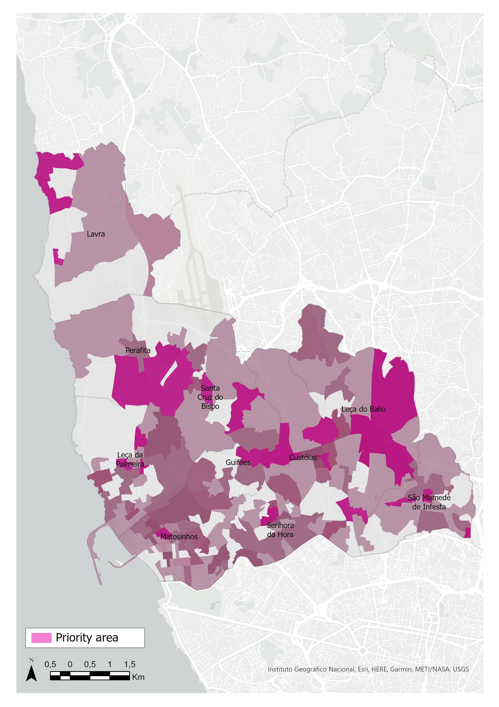

# Scaling micro-mobility to meet citizen demand in Matosinhos

Finalist project presented at the Eurekathon gala in November 2021, a datathon aimed at solving mobility challenges in the city of Matosinhos.

https://www.eurekathon.com/

Our strategy aimed at increasing micro-mobility in the city by 10% through the identification of areas with most potential demand. In order to reinforce our approach, we used unsupervised machine learning to classify them according to their specific characteristics. 

With this, we were able to provide the city council with a tailor-made tool to expland micromobility infrastructure with a clear target. 

  

Team members: Nicolo Ferrari, Elena Salgueiro, Desh Deepak, Marta Bescansa
